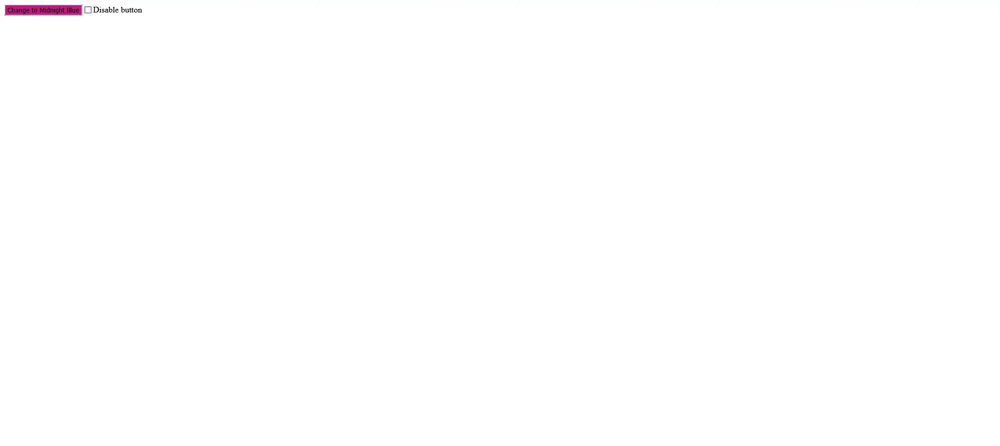

<!-- ===== HEADER ===== -->
<p align="right">
  <a href="./README.md" title="Read the README in english">
    
  </a>
  
</p>

<h1 align="center">
  <a
    href="https://guipmdev-color-button.vercel.app/"
    title="Acessar a aplicação web"
  >
    color-button
  </a>
</h1>

<p align="center">
  
  
  <a
    href="https://github.com/guipmdev/color-button/actions/workflows/node.js.yml"
    title="Visualizar execuções do workflow do GitHub"
  >
    
  </a>
  
  
  <a
    href="https://github.com/guipmdev/color-button/commits/main"
    title="Visualizar commits do repositório"
  >
    
  </a>
  <a href="./LICENSE" title="Visualizar licença do projeto">
    
  </a>
  <a href="https://bonnie.dev/" title="Acessar o site da Bonnie">
    
  </a>
</p>



<p align="center">
  <a href="https://guipmdev-color-button.vercel.app/"
    >Acessar a aplicação web ↗</a
  >
</p>

<details>
  <summary>
    <h2>📒 Índice</h2>
  </summary>

- [📍 Visão geral](#-visão-geral)
- [✨ Funcionalidades](#-funcionalidades)
- [🤖 Demo](#-demo)
- [🛠 Tecnologias](#-tecnologias)
  - [Website](#website)
  - [Úteis](#úteis)
- [🚀 Primeiros passos](#-primeiros-passos)
  - [✔️ Pré-requisitos](#️-pré-requisitos)
  - [📦 Instalação](#-instalação)
  - [⚙️ Utilização](#️-utilização)
  - [🧪 Executando testes](#-executando-testes)
- [📄 Licença](#-licença)
- [👏 Reconhecimentos](#-reconhecimentos)
</details>

<!-- ===== PROJECT INFOS ===== -->

## 📍 Visão geral

O projeto **color-button** é uma aplicação web desenvolvida em _React_ que consiste em um botão e uma caixa de seleção. O botão permite que os usuários alternem entre duas cores, Vermelho Violeta Médio e Azul Meia-Noite, e a caixa de seleção pode desativar ou ativar novamente esse botão.

O principal objetivo é mostrar uma funcionalidade básica em React com testes Jest e Testing Library.

## ✨ Funcionalidades

🎨 **Alterne entre duas cores** no clique de um botão

🔛 **Desativar e reativar o botão** usando a caixa de seleção

🧪 Projeto **focado em testes** Jest e Testing Library

## 🤖 Demo

## 🛠 Tecnologias

As seguintes ferramentas foram usadas para desenvolver esse projeto:

### Website

<p>
  <a href="https://react.dev/">
    
  </a>
  <a href="https://eslint.org/">
    
  </a>
</p>

<p>
  <a href="https://testing-library.com/">
    
  </a>
  <a href="https://www.npmjs.com/package/jest-junit">
    
  </a>
</p>

_\* Confira o arquivo [<kbd>package.json</kbd>](./package.json)_

### Úteis

<p>
  <a href="https://git-scm.com/">
    
  </a>
  <a href="https://nodejs.org/">
    
  </a>
  <a href="https://code.visualstudio.com/">
    
  </a>
</p>

## 🚀 Primeiros passos

### ✔️ Pré-requisitos

Antes de você começar, certifique-se que você tem as seguintes ferramentas instaladas na sua máquina: [Git](https://git-scm.com/downloads), [Node.js](https://nodejs.org/en/download). Também é bom ter um editor para trabalhar com o código, como o [VSCode](https://code.visualstudio.com/Download).

### 📦 Instalação

1. Clone o repositório:

```sh
git clone https://github.com/guipmdev/color-button/
```

2. Mude para o diretório do projeto:

```sh
cd color-button
```

3. Instale as dependências:

```sh
npm install
```

### ⚙️ Utilização

1. inicie a aplicação web:

```sh
npm run start
```

2. Acesse https://localhost:3000/ para visualizar a aplicação

### 🧪 Executando testes

```sh
npm run test
```

## 📄 Licença

Este projeto está licenciado de acordo com os termos da licença `MIT`. Consulte o arquivo [LICENSE](./LICENSE) para mais informações.

## 👏 Reconhecimentos

> - Muito obrigado à [Bonnie Schulkin](https://bonnie.dev/) pelo layout e pelas dicas de como montar este projeto

<!-- ===== FOOTER ===== -->

---

<p align="center">
  Feito com 💙 por
  <a href="https://www.guipm.dev/"> @guipm.dev </a>
  - Fique à vontade para
  <a href="mailto:guipm.dev@gmail.com">entrar em contato comigo</a>!
</p>

<br />

<p align="center">
  <a href="#top">
    <b>↑&nbsp;&nbsp; Voltar ao topo &nbsp;&nbsp;↑</b>
  </a>
</p>
